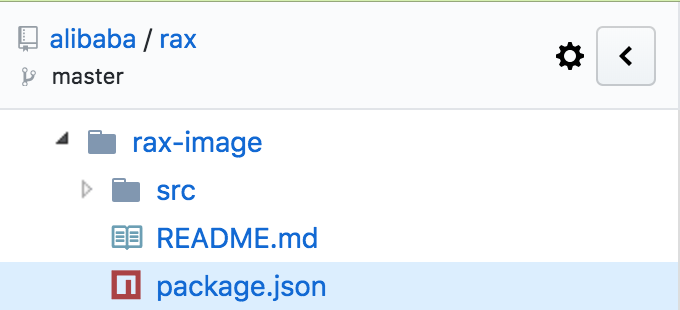

Rax学习手册
==

[TOC]

## 1、Rax是什么（TODO重新修改）

按照小白方式去解释，Rax是一个高级的前端语言，这种语言的代码，需要经过编译器来生成JavaScript代码以及HTML代码。用它来开发页面，既能适配Web浏览器（PC或移动端），也能适配App页面（iOS或Android）。


## 2、使用Rax需要哪些东西


### （1）编译器以及配套工具

​        Rax的[Git主页](https://github.com/alibaba/rax)，提供npm包，即rax-cli。安装rax-cli后，可以使用rax命令来生成rax项目所需要一些文件（所谓的脚手架方式）以及编译、运行等。

​        Rax的[文档主页](https://alibaba.github.io/rax/)，用于宣传、托管在线文档等，

* 安装rax-cli命令行工具

```shell
$ npm install rax-cli -g
$ rax init YourProjectName
```

> -g/--global，全局安装package

* 运行Rax项目

```
$ cd YourProjectName
$ npm run start
```


### （2）了解Rax语法

举一个Rax代码的例子，如下

```javascript
// 1.
import {createElement, Component, render} from 'rax';
import Text from 'rax-text';

// 2.
class Hello extends Component {
  render() {
    return [
      // 3.
      <Text style={styles.title}>Hello Rax</Text>,
      <Text style={styles.title}>Hello {this.props.name}</Text>,
    ];
  }
}

// 4.
const styles = {
  title: {
    color: '#ff4400',
    fontSize: 48,
    fontWeight: 'bold',
  }
};

// 5.
render(<Hello name="world" />);
```


对应序号的代码，解释如下

1）导入所需要的类、方法等，这个和python语法有点类似。

例如`import {createElement, Component, render} from 'rax';`的意思是

从rax模块（位于项目node_modules/rax/src）中导入render函数（位于render.js）、Component类（位于component.js）、createElement函数（位于element.js）


2）定义Hello这个类，它继承Component类，而Component类已经使用import语法从rax库中导入进来。注意，Hello这个类也是一个组件，可以用标签形式使用。


3）使用Text组件，它是一个XML标签，使用基本和HTML标签差不多


4）定义全局变量styles，类型是字典，用于存放css样式。当然这个样式也可以用单独css文件存放


5）使用render函数，渲染指定的组件。这里是已经定义好的Hello组件。

根据上面代码的分析，相比传统直接HTML代码的方式，总结几条Rax语法的优势，如下

* 面向对象的思想，有类、方法等的概念。面向对象编程优势，Rax都全部拥有。
* 标签语法，兼顾HTML编写方式，方便使用HTML类似的语法，比如style。
* 标签和类等价，这样基本可以确定好一个组件。定义组件，使用类定义。使用组件，采用标签方式。


### （3）前端开发知识

Rax实际是前端一个框架，因此需要前端一些开发知识。大致有下面几个方面

* HTML，常用标签，比如div
* CSS，CSS用法以及flexbox等
* JavaScript，JS开发


### （4）支持Rax代码的客户端SDK

如果Rax编写的页面，也需要呈现在App上，那么客户端（iOS或Android）需要集成WeexSDK


## 3、Rax的几个概念

Rax和React类似，但是不清楚React也没有关系，直接介绍Rax开发需要的几个概念。这些概念会体现Rax代码上。

* 组件 (Component)
* 属性 (Props)
* 状态 (State)
* 事件 (Event)
* 样式 (CSS)


### （1）组件 (Component)

组件是可复用的UI单元，比如Rax内置提供的Text、Image等。

Rax使用Component类代表一个组件，所有自定义的组件都继承自Component。

Component定义有两种方式

* 使用class定义，继承Component

```javascript
class Hello extends Component {
  render() {
    return <Text>Hello {this.props.name}!</Text>;
  }
}
render(<Hello name="World" />);
```

这里Hello类中render函数是回调函数，直接返回Hello组件的内容。而外部的render函数定义在render.js中。


* 使用function定义

```javascript
function Hello(props) {
  return <Text>Hello {props.name}</Text>;
}
render(<Hello name="World!" />);
```

Hello函数带一个props参数，直接返回Hello组件的内容。


### （2）属性 (Props)

组件（component）内部会维护一个props变量，用于传递组件的属性。例如之前的例子，如下

```javascript
class Hello extends Component {
  render() {
    return <Text>Hello {this.props.name}!</Text>;
  }
}
render(<Hello name="World" />);
```

在组件内部可以直接使用this.props引用到Hello标签中name属性。


### （3）状态（State）

状态（State），可以认为是class内部通用的Props，因为props变量组件默认存在，而state是自定义增加的内部变量。

```javascript
class Clock extends Component {

  timestamp = {
    title: 'Now',
  }

  state = {
    time: Date.now(),
  };

  componentDidMount() {
    this.timer = setInterval(() => {
      this.setState({ time: Date.now() });
    }, 1000); // 1 second
  }

  ComponentWillUnmount() {
    clearInterval(this.timer);
  }

  render() {
    const time = new Date(this.state.time).toLocaleTimeString();

    return (
      <View>
        <Text>{ this.timestamp.title }: { time }</Text>
      </View>
    );
  }
}

render(<Clock />);
```

上面`timestamp`和`state`变量都属于状态（State）。


### （4）事件 (Event)

事件（Event），指的是用户的交互以及特定的时机，包括点击事件、UI元素Appear事件、滚动事件、用户输入事件、复杂手势事件等。

这里列举几个常用事件

* 简单的点击事件

```javascript
import {createElement, Component, render} from 'rax';
import ScrollView from 'rax-scrollview';
import Touchable from 'rax-touchable';
import Text from 'rax-text';

class EventTouch extends Component {
  render() {
    return (
      <ScrollView>
        <Touchable onPress={() => console.log('pressed')}>
          <Text>Proper Touch Handling</Text>
        </Touchable>
      </ScrollView>
    );
  }
}

render(<EventTouch />);
```

Touchable组件提供接收点击事件，onPress属性是点击回调。

* UI元素appear/disappear事件

```javascript
import {createElement, Component, render} from 'rax';
import Text from 'rax-text';
import View from 'rax-view';

class EventAppear extends Component {
  render() {
    return (
      <View onAppear={(ev) => {
        console.log('appear');
      }} onDisappear={(ev) => {
        console.log('disappear');
      }}>
        <Text>Hello world</Text>
      </View>
    );
  }
}

render(<EventAppear />);
```

View组件有两个事件回调：onAppear和onDisappear

* 滚动事件

```javascript
import {createElement, Component, render} from 'rax';
import Text from 'rax-text';
import ScrollView from 'rax-scrollview';

class EventScroll extends Component {
  render() {
    return (
      <ScrollView loadMoreOffset={300} onLoadMore={() => {}}>
        <Text style={{
          color: '#ffffff',
          margin: '5rem',
          fontSize: '100rem',
          backgroundColor: 'blue'
        }}>
          Shake or press menu button for dev menuShake or press menu button for dev menu
          Shake or press menu button for dev menuShake or press menu button for dev menu
          Shake or press menu button for dev menuShake or press menu button for dev menu
          Shake or press menu button for dev menuShake or press menu button for dev menu
        </Text>
      </ScrollView>
    );
  }
}

render(<EventScroll />);
```

* 用户输入事件

```javascript
import {createElement, Component, render} from 'rax';
import TextInput from 'rax-textinput';

class EventTextInput extends Component {
  render() {
    return (
      // Note: 
      // call `onFocus` when textInput get focus 
      // call `onBlur` when textInput lose focus 
      // call `onInput` when textInput get a type 
      <TextInput
        placeholder="Enter text to see events"
        autoFocus multiline
        onFocus={() => console.log('onFocus')}
        onBlur={() => console.log('onBlur')}
        onInput={() => console.log('onInput')}
        style={{
          width: '1000rem',
          height: '1000rem',
          border: '1px solid #000'
        }}
      />
    );
  }
}

render(<EventTextInput />);
```

* 手势事件

// TODO: 


### （5）样式 (CSS)

* 内嵌CSS样式

```javascript
import {createElement, Component, render} from 'rax';
import View from 'rax-view';
import Text from 'rax-text';

class CssInner extends Component {
  styles = {
    container: {
      // Note: inner css not support `-`
      // use background instead of background-color
      background: 'grey',
      width: '750rem'
    }
  };

  render() {
    return (
      // Note: use `this` to access properties
      <View style={this.styles.container}>
        <Text>hello world</Text>
      </View>
    );
  }
}

render(<CssInner />);
```

styles是CssInner类的属性（property），render函数使用它，styles定义必须在render函数之前。this关键字，可以访问属性。

>
内嵌CSS不支持中划线，例如background-color，需要换成background。

* 外部CSS样式

```javascript
import {createElement, Component, render} from 'rax';
import styles from './index.css';

class CssOutter extends Component {
  render() {
    return <div style={styles.container}>
            <span style={styles.container_title}>hello world</span>
          </div>;
  }
}

render(<CssOutter />);
```

index.css

```css
.container {
  background-color: blue;
}

.container_title {
  font-size: 20px;
}
```

外部CSS样式，指定是CSS样式定义在单独的css文件中。rax使用import/from导入样式，默认使用styles属性来访问CSS属性。

>
外部CSS样式，允许中划线，例如background-color

## 4、Rax语法(TODO)


## 5、Rax组件

#### （1）安装组件

Rax的[Git主页](https://github.com/alibaba/rax)，除了提供rax-cli命令行工具，还提供一些rax组件，每个rax组件是一个npm包，如下



* src，存放js代码
* README.md，rax组件的安装以及使用信息
* package.json，rax组件的基本信息，例如包依赖、git地址等


#### （2）网络请求组件

网络请求可以使用rax库内置的fetch函数，或者使用jsonp库的jsonp函数

* fetch函数，支持promise形式的链式调用

```javascript
import {createElement, Component, render} from 'rax';
import Text from 'rax-text';

class NetworkFetch extends Component {
  render() {
    fetch('./11_network_fetch/api.json', {
      mode: 'same-origin',
      dataType: 'json',
      method: 'GET'
    })
    .then((response) => {
      return response.json();
    })
    .then((data) => {
      console.log(data);
      console.log(data.title); // equal to data['title']
    })
    .catch((err) => {
      // handle exception
      console.log('an exception occurred');
      console.log(err);
    });

    return (
      <Text>
      Use fetch global function
      </Text>
    );
  }
}

render(<NetworkFetch />);
```

* jsonp函数，需要安装jsonp库

```javascript
import {createElement, Component, render} from 'rax';
import Text from 'rax-text';
import jsonp from 'jsonp';

class NetworkJSONP extends Component {
  render() {
    // processJSON(['some string 1', 'some data', 'whatever data'])
    jsonp('http://localhost/jsonp', { name: 'processJSON' }, (err, data) => {
      if (err) {
        console.log(err);
      }
      console.log(data);
    });

    return (
      <Text>
        Use jsonp function from jsonp lib.
      </Text>
    );
  }
}

render(<NetworkJSONP />);
```


#### （3）文本组件\<Text/\>

\<Text\>\<Text/\>标签会被转成\<span\>\</span\>


## 6、Rax项目构成

使用rax-cli提供的rax命令，`rax init <project name>`，初始化一个Rax项目，如下

```shell
rax git:(daily/0.0.1) ✗ tree -L 2
.
├── README.md
├── abc.json
├── build
├── node_modules
│   ├── _driver-browser@0.6.1@driver-browser
│   ├── _driver-server@0.6.1@driver-server
│   ├── _driver-weex@0.6.1@driver-weex
│   ├── _rax-image@0.6.1@rax-image
│   ├── _rax-text@0.6.1@rax-text
│   ├── _rax-touchable@0.6.1@rax-touchable
│   ├── _rax-view@0.6.1@rax-view
│   ├── _rax@0.6.1@rax
│   ├── _style-unit@0.6.1@style-unit
│   ├── _universal-env@0.6.1@universal-env
│   ├── driver-browser -> _driver-browser@0.6.1@driver-browser
│   ├── driver-server -> _driver-server@0.6.1@driver-server
│   ├── driver-weex -> _driver-weex@0.6.1@driver-weex
│   ├── rax -> _rax@0.6.1@rax
│   ├── rax-image -> _rax-image@0.6.1@rax-image
│   ├── rax-refreshcontrol
│   ├── rax-scrollview
│   ├── rax-text -> _rax-text@0.6.1@rax-text
│   ├── rax-touchable -> _rax-touchable@0.6.1@rax-touchable
│   ├── rax-view -> _rax-view@0.6.1@rax-view
│   ├── style-unit -> _style-unit@0.6.1@style-unit
│   └── universal-env -> _universal-env@0.6.1@universal-env
├── package-lock.json
├── package.json
├── pagemaster
│   ├── web.xtpl
│   └── weex.xtpl
└── src
    ├── mods
    └── pages
```

>
也可以使用def工具的`def init`命令

几个重要文件夹，简单介绍下

* node_modules

项目所需要库的存放文件夹，类似CocoaPods的Pods文件夹。一般Rax项目初始化后，有一些基础库，例如rax、rax-text等。如果还需要其他的库，可以使用`npm install <rax library>`，npm 5.0版本不需要使用`--save`选项[^1]

* package.json

项目所需要库的记录文件，类似CocoaPods的Podfile文件。使用npm来安装或卸载等，会自动更新该文件，因此一般不需要手动修改该文件。

* package-lock.json

根据文件名称，猜测和Podfile.lock文件的作用有点像

* src/mods

存放模块代码的文件夹。`def add`添加模块，会在此文件夹下添加对应的一些文件

* src/pages

存放页面代码的文件夹。`def add`添加页面，会在此文件夹下添加对应的一些文件


## 7、node.js相关知识(TODO删除)

node.js的包管理器是npm，MacOS下可以使用brew安装，`brew install npm`。

#### （1）npm常用命令

##### 1) npm help

格式：npm help \<command\>    
说明：查看某个command的帮助信息，例如`npm help install`

##### 2) npm install

格式： npm install [options] \<package\>    
说明：安装npm包，不带任何option，默认安装在当前node工程下面

>
--save-dev，package.json中的devDependencies字段添加依赖     
--save/--save-prod，package.json中的dependencies字段添加依赖

* 安装某个版本

```
$ npm install crypto-browserify@3.11.0 --save
```

##### 3) npm view

* npm view crypto-browserify version

查看某个npm包版本


## 8、rax编译常见报错

* styles命名冲突

使用`import styles from './index.css'`导入变量名styles，而在js代码中又定义了全局变量styles。

解决方法：只保留一种styles变量的引用。

```
ERROR in ./src/pages/19_control_image_remote/index.js
Module build failed: TypeError: Cannot read property 'file' of undefined
    at Scope.checkBlockScopedCollisions (/Users/wesley_chen/.def/def_modules/.builders/@ali/builder-rax/node_modules/_babel-traverse@6.26.0@babel-traverse/lib/scope/index.js:398:22)
    at Scope.registerBinding (/Users/wesley_chen/.def/def_modules/.builders/@ali/builder-rax/node_modules/_babel-traverse@6.26.0@babel-traverse/lib/scope/index.js:592:16)
    at Scope.registerDeclaration (/Users/wesley_chen/.def/def_modules/.builders/@ali/builder-rax/node_modules/_babel-traverse@6.26.0@babel-traverse/lib/scope/index.js:496:14)
    at Object.BlockScoped (/Users/wesley_chen/.def/def_modules/.builders/@ali/builder-rax/node_modules/_babel-traverse@6.26.0@babel-traverse/lib/scope/index.js:244:28)
    at Object.newFn (/Users/wesley_chen/.def/def_modules/.builders/@ali/builder-rax/node_modules/_babel-traverse@6.26.0@babel-traverse/lib/visitors.js:318:17)
    at NodePath._call (/Users/wesley_chen/.def/def_modules/.builders/@ali/builder-rax/node_modules/_babel-traverse@6.26.0@babel-traverse/lib/path/context.js:76:18)
    at NodePath.call (/Users/wesley_chen/.def/def_modules/.builders/@ali/builder-rax/node_modules/_babel-traverse@6.26.0@babel-traverse/lib/path/context.js:44:14)
    at NodePath.visit (/Users/wesley_chen/.def/def_modules/.builders/@ali/builder-rax/node_modules/_babel-traverse@6.26.0@babel-traverse/lib/path/context.js:105:12)
    at TraversalContext.visitQueue (/Users/wesley_chen/.def/def_modules/.builders/@ali/builder-rax/node_modules/_babel-traverse@6.26.0@babel-traverse/lib/context.js:150:16)
    at TraversalContext.visitMultiple (/Users/wesley_chen/.def/def_modules/.builders/@ali/builder-rax/node_modules/_babel-traverse@6.26.0@babel-traverse/lib/context.js:103:17)
    at TraversalContext.visit (/Users/wesley_chen/.def/def_modules/.builders/@ali/builder-rax/node_modules/_babel-traverse@6.26.0@babel-traverse/lib/context.js:190:19)
    at Function.traverse.node (/Users/wesley_chen/.def/def_modules/.builders/@ali/builder-rax/node_modules/_babel-traverse@6.26.0@babel-traverse/lib/index.js:114:17)
    at traverse (/Users/wesley_chen/.def/def_modules/.builders/@ali/builder-rax/node_modules/_babel-traverse@6.26.0@babel-traverse/lib/index.js:79:12)
    at NodePath.traverse (/Users/wesley_chen/.def/def_modules/.builders/@ali/builder-rax/node_modules/_babel-traverse@6.26.0@babel-traverse/lib/path/index.js:144:25)
    at Scope._crawl (/Users/wesley_chen/.def/def_modules/.builders/@ali/builder-rax/node_modules/_babel-traverse@6.26.0@babel-traverse/lib/scope/index.js:828:10)
    at Scope.crawl (/Users/wesley_chen/.def/def_modules/.builders/@ali/builder-rax/node_modules/_babel-traverse@6.26.0@babel-traverse/lib/scope/index.js:749:10)
 @ multi pages/19_control_image_remote/index.weex
```

* render方法返回的是的多个标签

解决方法：render方法返回的root标签必须只有一个标签

```
ERROR in ./src/pages/17_control_qrcode/index.js
    
    /Users/wesley_chen/Ali-Projects/rax-projects/rax/src/pages/17_control_qrcode/index.js
      26:9  error  Parsing error: Adjacent JSX elements must be wrapped in an enclosing tag
    
      24 |       // <View>
      25 |         <Text>QRCode: {this.state.qrcode}</Text>
    > 26 |         <Image source={this.state.qrcode} />
         |         ^
      27 |       // {/* </View> */}
      28 |     );
      29 |   }
    
    ✖ 1 problem (1 error, 0 warnings)
```


## 附录

### 1、rax常用命令

| 命令                                 | 用法            | 说明                           |
| ------------------------------------ | --------------- | ------------------------------ |
| `rax init <ProjectName> [--verbose]` | 创建一个rax工程 | 可以不填工程名，进入交互式环境 |
|                                      |                 |                                |


## References

[^1]: https://stackoverflow.com/questions/19578796/what-is-the-save-option-for-npm-install